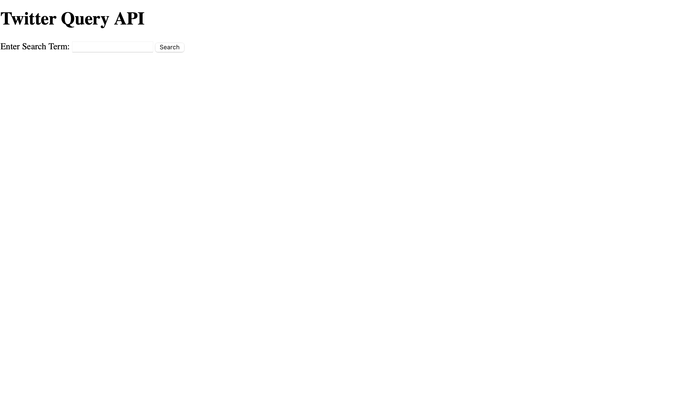
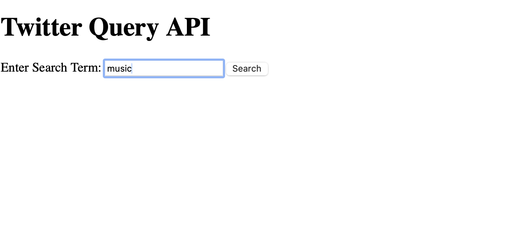
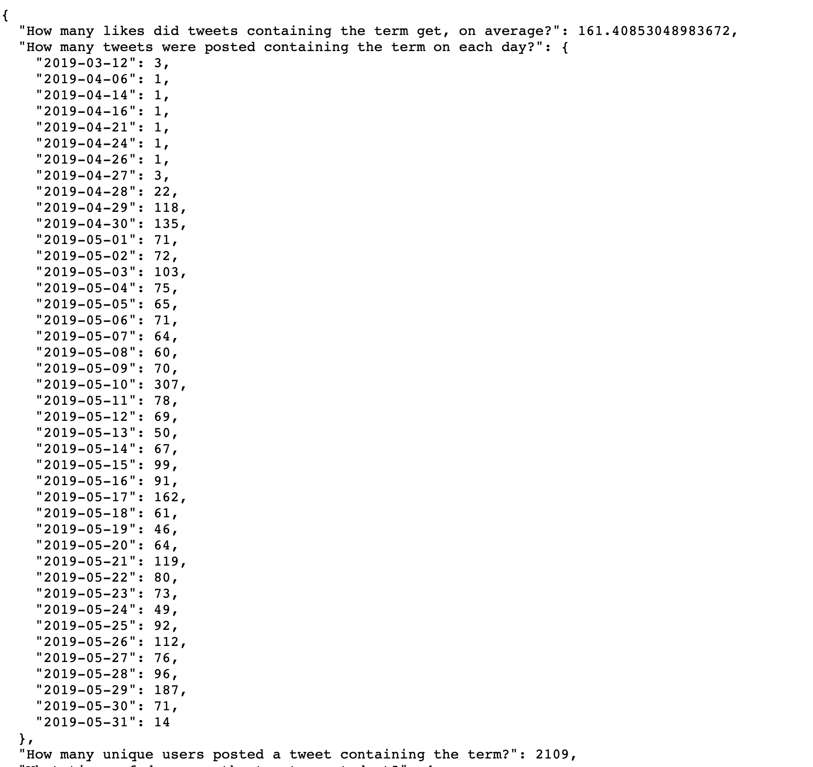
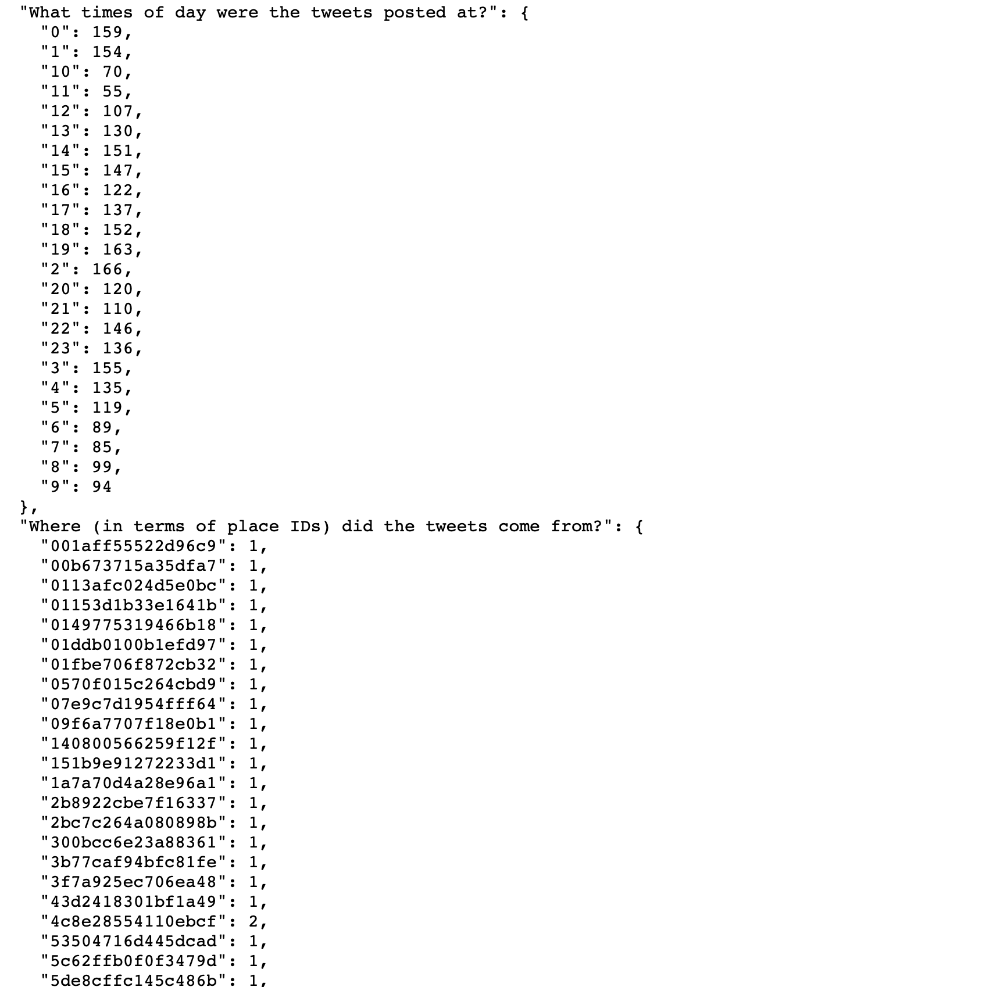
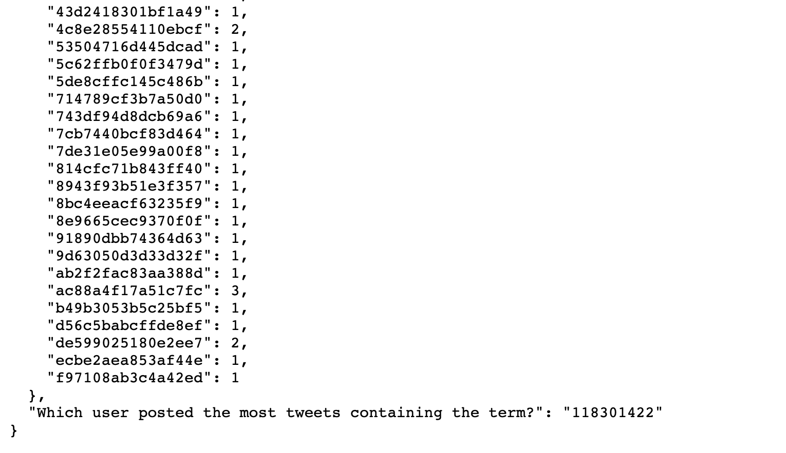

## POTATO Take Home Task
---
[](URL-to-build) 
[](URL-to-dependencies)
[](https://opensource.org/licenses/MIT)

## 🥔 Overview

This project implements a Flask-based API that queries a dataset of tweets and provides insights such as the number of tweets containing a term, the number of unique users, tweet timings, and more. The API is optimized for quick responses and is designed to be deployed in a Docker container for ease of use.
### 🔍 Key Column Explanations which is used in queries, droped rest of it to be more optimised

- **id**: Unique identifier for each event.
- **text**: The content of the tweet.
- **author_id**: ID of the author of the tweet.
- **author_handle**: Twitter handle of the author.
- **created_at**: Timestamp of when the tweet was created.
- **author_follower_count**: Number of followers the author has.
- **retweet_count**: Number of times the tweet has been retweeted.
- **reply_count**: Number of replies to the tweet.
- **like_count**: Number of likes the tweet has received.
- **quote_count**: Number of quotes of the tweet.
- **hashtags**: Hashtags used in the tweet (object).
- **place_id**: ID of the place associated with the tweet (object).


### 🕒 Queries
- How many tweets were posted containing the term on each day?
- How many unique users posted a tweet containing the term?
- Average likes on tweets containing the term.
- Locations (place IDs) where the tweets came from.
- Times of day the tweets were posted.
- The user who posted the most tweets with the term.

---

## Table of Contents
- [✨ Featuresfeatures)
- [📚 Libraries](#Libraries)
- [📁 File Structure](#fileStructure)
- [📝 Explanation of Important Files](#ExplanationofImportantFiles)
- [🚀 Setup Instructions](#SetupInstructions)
- [💡 Design Choices](#DesignChoices)
- [💻 Installation](#installation)
- [📸 Application Screenshot](#ApplicationScreenshot)
- [📜 License](#license)


## ✨ Features

- **Search tweets by terms**: Users can input a search term to find tweets containing that term, and the application will return the relevant results.
  
- **Analyze tweet frequency**: The app analyzes how many tweets contain the specific term on each day. This helps understand trends over time.

- **Convert `created_at` column to datetime**: The `created_at` column, which was initially in `object` format, is now converted to `datetime` format. This allows for more efficient time-based analysis, such as grouping tweets by day or time.

- **Serialization of output to JSON**: The results from the search and analysis are serialized into a JSON file for easy access and further use. This ensures compatibility with other systems that might need to ingest the data.

- **Calculate average likes**: The application calculates the average number of likes received by tweets containing the search term. This provides insights into the engagement levels of those tweets.

- **Identify locations from tweets**: Using the `place_id` column, the app identifies the geographic locations where the tweets originated from, offering additional context for the tweets.

- **Analyze the timing of tweets**: The app analyzes and visualizes the time of day at which the tweets were posted, giving a breakdown of tweeting behavior across different times.

- **Data visualization**: If applicable, the app provides visual representations of the data to offer deeper insights into the trends.


## 📚 Libraries

This project uses the following libraries:

- **Flask**: A micro web framework for Python, used for building the API.
- **request**: A micro web framework for Python, used for building the API.
- **jsonify**: A powerful data manipulation and analysis library for Python, used for handling the tweet dataset.
- **render_template**: A library for numerical computing in Python, often used with Pandas for data manipulation.
- **flask_caching**: A plotting library for creating static, animated, and interactive visualizations in Python.
- **Pandas**: A powerful data manipulation and analysis library for Python, used for handling the tweet dataset.
- **NumPy**: A library for numerical computing in Python, often used with Pandas for data manipulation.
- **Matplotlib**: A plotting library for creating static, animated, and interactive visualizations in Python.
- **Docker**: A platform for developing, shipping, and running applications inside containers.


## 📁 File Structure
```plaintext
📂 POTATO-Take-Home-Task
│
├── templates/
│   └── home.html             # Simple frontend for query input
├── Dataset/
│   ├── cleaned.tsv           # ETL performed tweet dataset (used for querying)
│   └── twitter.tsv           # Original dataset 
├── app.py                    # Main Flask application
├── Dockerfile                # Dockerfile to build the project image
├── requirements.txt          # Python dependencies
└── data_stats.ipynb         # Jupyter notebook for dataset analysis

```

## 📝 Explanation of Important Files
- **app.py**: The main application script that sets up the Flask server and handles querying of the dataset.
- **Dockerfile**: A configuration file that helps you run the project in a Docker container for easier setup.
- **templates/home.html**: A basic HTML page that allows users to search for a term via a form.
- **dataset/**: Contains the datasets used in the project:
  - `cleaned.tsv`: The cleaned version of the dataset with ETL processes applied, ready for querying.
  - `twitter.tsv`: The original raw dataset used for analysis.

## 🚀 Setup Instructions

### Prerequisites
Make sure you have the following installed:

- **Python 3.11+**
- **Docker**

## 💡 Design Choices
- **Flask**: Chosen for its simplicity and flexibility in creating APIs.
- **Pandas**: Used to handle and manipulate large datasets efficiently.
- **Flask-Caching**: To speed up queries by caching responses for frequently searched terms.
- **Docker**: Provides an easy way to package the application along with its dependencies so it can run consistently across different environments.


## 💻 Installation

### Clone the Repository
```bash
git clone git@github.com:ritika4554244/POTATO-Take-Home-Task.git
cd POTATO-Take-Home-Task
```

### Set Up Python Environment
Install the required Python packages using pip:
```bash
pip install -r requirements.txt
```

### Run the Application

You can run the Flask application directly:

```bash
python app.py
```
## 📸 Application Screenshot

Here’s a screenshot of the application in action:








